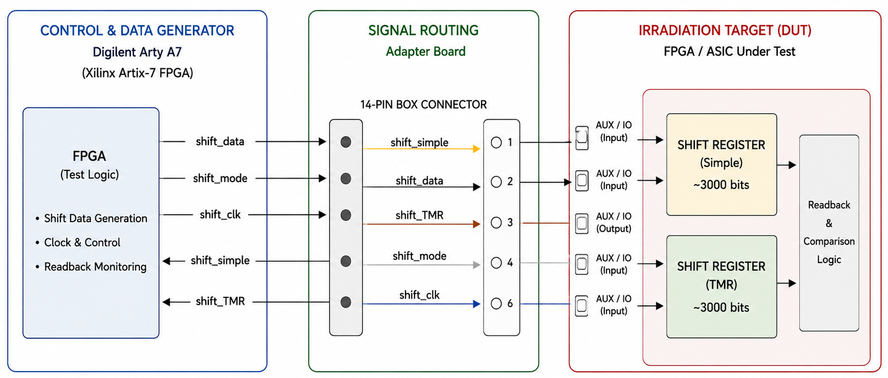
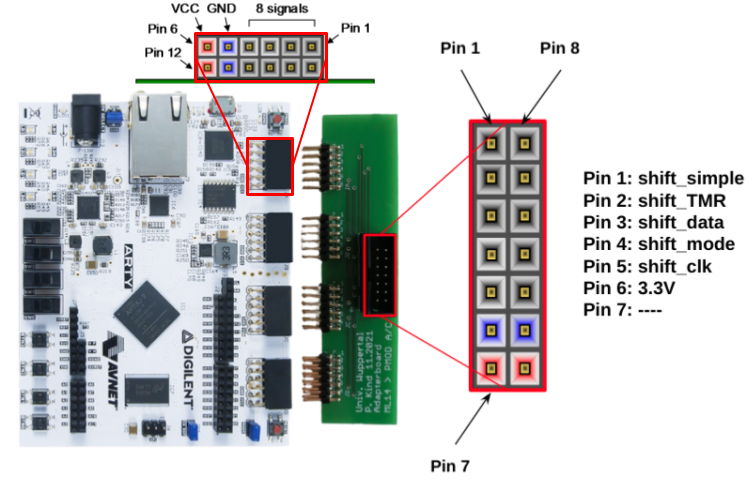

# SEU Evaluation System

A hardware and software framework for evaluating Single Event Upsets (SEUs) in digital logic using configurable shift-register test structures implemented
on FPGA devices.

The system provides:
- configurable SEU test patterns
- continuous write/readback verification
- irradiation data acquisition
- automated logging and analysis
- comparison between standard and TMR-protected logic

===============================================================================
REPOSITORY STRUCTURE
===============================================================================

.
├── firmware/          FPGA/Vivado sources
├── python/            Data acquisition and analysis scripts
├── work/              Vivado project recreation scripts
├── constraints/       FPGA pin constraints
├── bitstreams/        Generated FPGA images
└── irradiation_data/  Acquired measurement data


===============================================================================
RECREATING THE VIVADO PROJECT
===============================================================================

Requirements:
- Vivado
- Xilinx SDK / Vitis
- [Digilent Arty A7 board](https://digilent.com/reference/programmable-logic/arty-a7/reference-manual)

1. Navigate to the work directory:`cd work`
2. Open Vivado and execute the TCL script from the Vivado TCL console: `source ./vivado/recreate_project.tcl`
3. Generate the FPGA bitstream.
4. Export the hardware design including the bitstream: `File -> Export -> Export Hardware`
   Enable:
   [x] Include bitstream
5. Create the bootloader and program the SPI flash using the
   Xilinx SDK/Vitis workflow.

Reference:
https://digilent.com/reference/learn/programmable-logic/tutorials/htsspisf/start

===============================================================================
Running an SEU Test
===============================================================================

Navigate to the Python directory:
```bash
cd python
  # Run the SEU acquisition script:
/usr/bin/python3 test_seu.py -c 2 -f 1000
```
```bash
Script Options
---------------

-h    Show help
-m    Manual mode
-d    Enable debug output
-c    Chip ID
-n    Number of FPGA devices
-t    Shift hold time (s)
-f    Shift frequency (kHz)
-F    Shift frequency (Hz)
-a    ADC monitoring interval (s)
```

The acquisition script generates irradiation data under:
```bash
python/irradiation_data/<CHIP_NAME>/
```
e.g: `python/irradiation_data/CHIP_NAME/SEU_Hold_Test_Info.txt`

To analyze recorded irradiation data: `/usr/bin/python3 analyze_Irradiation_data.py --all irradiation_data/<DATA_DIR>`
===============================================================================
TEST SETUP
===============================================================================



The setup consists of:
- FPGA-based data generator
- irradiation target board
- shift-register test structures
- readback monitoring infrastructure

Operation
---------

At each rising clock edge:
- data is shifted when shift_mode = 1
- data is held when shift_mode = 0

The readback stream is continuously monitored to detect SEU-induced bit flips.
===============================================================================
DATA GENERATOR BOARD
===============================================================================

The setup uses a Digilent Arty A7 FPGA development board featuring
a Xilinx Artix-7 FPGA as the central control and data-generation unit.



The Arty A7 has four Pmod connectors are assigned as following:<br>
<div align="center">

| -- | Pmod JA | Pmod JB | Pmod JC | Pmod JD| 
| -- | -- | -- | -- | -- |
| **Pmod Type** | **Standard** | **High-Speed** | **High-Speed** | **Standard**  | 
| **Pin 1** | [**G13**] dout[4]      | [E15] sck_o            | [U12] sclx2      | [D4] dout[0] | 
| **Pin 2** | [**B11**] _shift_mode_ | [E16] io1_i            | [V12] sdas       | [D3] din[0]  | 
| **Pin 3** | [A11] din[4]           | [D15] ss_enc_out[1]    | [V10] sdas_dec   | [F4] din[2]  | 
| **Pin 4** | [**D12**] _shift_TMR_  | [C15]                  | [**V11**] _shift_clk_  | [F3] dout[2] | 
| **Pin 5** | GND  | GND                  | GND | GND |
| **Pin 6** | VCC  | VCC                  | VCC | VCC |
| **Pin 7** | [**D13**] _shift_data_ | [J17] io0_o            | [U14] sdam       | [E2] dout[1] | 
| **Pin 8** | [B18]                  | [J18] ss_enc_out[0]    | [V14]            | [D2] din[1]  | 
| **Pin 9** | [A18] din[5]           | [K15]                  | [T13]            | [H2] din[3]  | 
| **Pin 10** | [**K16**] _shift_simple_ | [J15] ss_enc_out[2] | [U13]            | [G2] dout[3] | 
| **Pin 11** | GND  | GND                  | GND | GND |
| **Pin 12** | VCC  | VCC                  | VCC | VCC |
</div>


===============================================================================
External connection to DUT
===============================================================================

The 14-pin Box connector is assigned as following:<br>
<div align="center">

 | Signal | MOPSHub.v1/J5 | MOPSHub.v2/J5 | 
| -- | -- | -- | 
 | **_simple_out_** /yellow | [**P15**] AUX1P [**Pin 1**] | [**A14**] IO1 [**Pin 1**]   |
| **_tmr_out_** /brown   | [**P16**] AUX2P [**Pin 3**] | [**D15**] IO3 [**Pin 3**]   |
 | **_shift_data_**/black | [**R16**] AUX1N [**Pin 2**]| [**D17**] IO5   [**Pin 5**] | 
| **_shift_mode_**/white | [**R17**] AUX2N [**Pin 4**]| [**A20**] IO7  [**Pin 7**]  |
 | **_shift_clk_**/blue  | [**P17**] AUX3N [**Pin 6**] | [**D19**] IO9  [**Pin 9**]  | 
</div>
